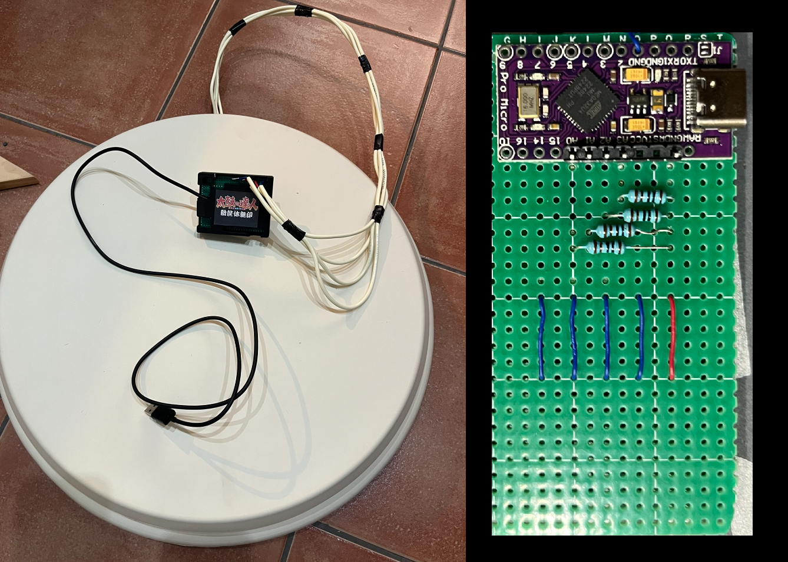
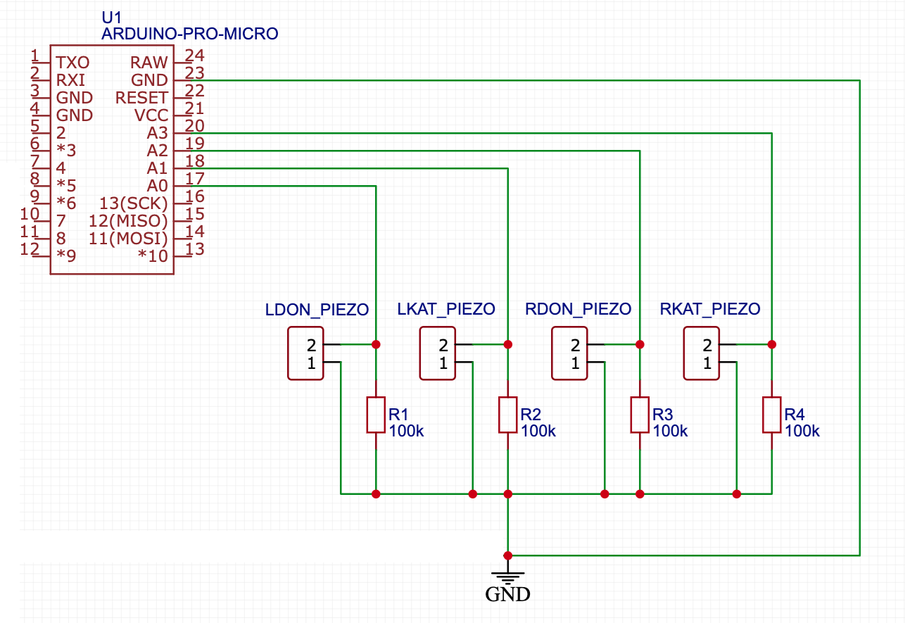

# 太鼓鼓控制器 - Arduino Pro Micro (ATmega32U4)

一个开源硬件项目，帮助你制作自己的**太鼓达人**PC控制器。

[查看繁体中文版](./README_zh-Hans.md) | [查看日文版](./README_Japanese.md) | [View English Version](./README.md)

## 关于本项目

本项目旨在帮助你创建一个自定义的太鼓达人控制器，让你在家中享受街机体验。

> **注意：** 本项目仅供个人和非商业用途。

---

## 所需材料

制作太鼓鼓控制器所需的材料：

1. **Arduino Micro/Leonardo**（带ATmega32U4微控制器）
2. **4个压电传感器**
3. **4个100kΩ电阻**
4. 基本电子元件（如面包板、跳线）
5. 木板和切割工具（仅在你从头开始制作鼓时需要）  
   > 如果你有售后市场的Taiko Force Lv5，也可以直接使用它。

---

## 制作步骤

1. **准备鼓**  
   制作鼓并将4个压电传感器牢固地粘在上面。参考下图查看传感器的推荐位置。

   

2. **连接组件**  
   按下图所示将压电传感器和其他组件连接到Arduino。  
   > 注意：压电传感器的极性无关紧要。本设计适用于Arduino Micro，如果使用其他板子，请参考其文档。

   

3. **烧录固件**  
   将固件上传到Arduino板上。可能需要调整一些参数，例如 `SAMPLE_CACHE_LENGTH`、`HIT_THRES`、`RESET_THRES` 和 `sensitivity`，详情见下文。

4. **开始游戏！**  
   设置完成后，控制器就可以使用了。

---

## 参数调整

1. **命中和重置阈值**  
   设置 `DEBUG 1` 以禁用键盘输出，并通过串口监视信号值。滚动鼓的4个区域之一，观察串口监视器的输出图形。  
   - **命中阈值**：应低于你最重的敲击。
   - **重置阈值**：应高于滚动敲击之间的低点（波谷）并低于命中值。  

   对每个鼓区重复此过程以找到最佳阈值。

   

2. **采样长度**  
   在 `cache.h` 中将 `SAMPLE_CACHE_LENGTH` 设置为2的幂（如2、8、16、32）。对于Arduino，**16** 是最佳值；如果你使用更快的微控制器（采样速度达到4000Hz或更高），可以设置为 **32**，以获得更平滑的信号。

3. **传感器灵敏度**  
   传感器输出可能会有所不同。使用 `sensitivity` 参数来规范差异。例如，如果 **右-don** 区域输出较高的值，可以将 `sensitivity` 设置为 `{1.0, 1.0, 0.5, 1.0}` 来平衡响应。

   

   > 传感器的安装非常重要。确保传感器牢固地固定在木板上。

4. **启动游戏**  
   调整完成后，启动游戏，享受你的自定义太鼓控制器！

---
